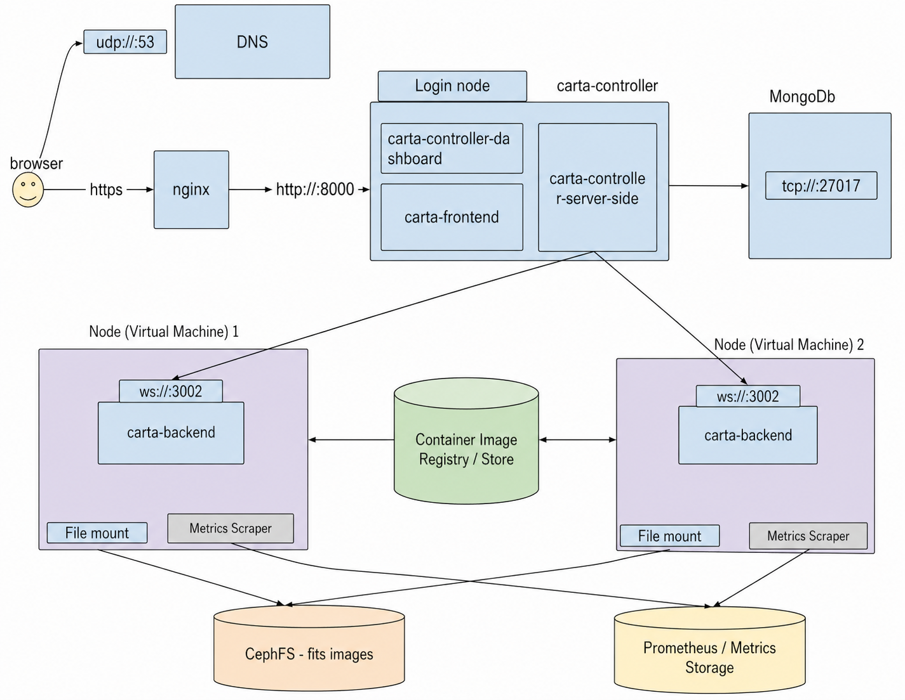
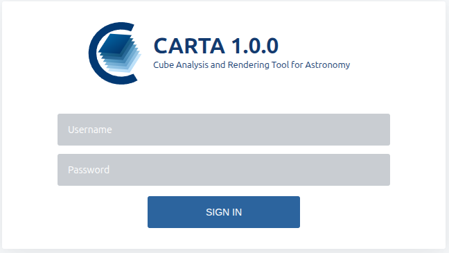

# CARTA Deployment Comparison

This repository compares two deployment approaches for the Cube Analysis and Rendering Tool for Astronomy (CARTA):

1. **Kubernetes deployment**
2. **HPC deployment using Slurm as the resource manager**

The purpose of this repository is to document how CARTA can be deployed in both environments and how the main CARTA components can be combined with shared storage, authentication, backend execution, and monitoring services.

The repository also includes a separate **local deployment** option for single-user testing. This local deployment is not part of the main comparison.

---

## Deployment Approaches

### 1. Kubernetes Deployment

The Kubernetes deployment uses Kubernetes to manage CARTA services. In this setup, CARTA backend instances are launched as pods on worker nodes.

This deployment includes:

- Kubernetes cluster setup
- CephFS shared storage integration
- MongoDB for CARTA controller state
- CARTA controller deployment
- Dynamic backend pod creation
- User mapping through `extrausers`
- Service, Ingress, or SSH tunnelling for access

Setup guide:

[Kubernetes Deployment Setup](https://github.com/Jotham12/carta-deployment-comparison/blob/main/Kubernetes-deployment/k8s-setup.md)

---

### 2. HPC Deployment Using Slurm

The HPC deployment uses Slurm as the resource manager. In this setup, the CARTA controller runs on the login/control node and launches CARTA backend instances as Slurm jobs on compute nodes.

This deployment includes:

- Slurm login/control node setup
- Slurm compute node setup
- Munge authentication
- MariaDB and SlurmDBD for Slurm accounting
- CephFS shared storage
- PAM authentication
- User-specific backend execution directories

Setup guide:

[HPC Deployment Setup](https://github.com/Jotham12/carta-deployment-comparison/tree/main/hpc-deployment)

---

### 3. Local Deployment / User Deployment Mode

The local deployment is not part of the main Kubernetes versus Slurm comparison. It is included for single-user testing, where a user wants to install and explore CARTA locally.

The script `installing_carta.sh` is provided under the `local-deployment` folder. This script installs CARTA for User Deployment Mode.

In this mode, CARTA can be installed on the same computer or across two different computers without using the `carta-controller`. The user manually starts `carta_backend` on the machine where the image data is stored and then connects to it from the CARTA frontend using a web browser.

---

## Repository Structure

```text
carta-deployment-comparison/
├── Kubernetes-deployment/
│   ├── carta-controller/
│   ├── scripts/
│   └── script-based-deployment.md
│
├── hpc-deployment/
│   ├── carta-controller/
│   ├── scripts/
│   └── README.md
│
├── local-deployment/
│   └── installing_carta.sh
│
├── architecture-diagram.png
├── diagram1.png
├── carta-login.png
└── README.md
```

---

## Architecture Diagram

The diagram below shows the main CARTA components that this repository combines across the two deployment approaches.



Users access CARTA through a browser. Requests are routed through DNS and NGINX to the CARTA controller. The controller provides the dashboard, serves the frontend, handles server-side logic, and communicates with MongoDB for persistent controller state.

The backend execution layer differs between the two deployments:

- In the Kubernetes deployment, CARTA backend instances are launched as Kubernetes pods.
- In the HPC/Slurm deployment, CARTA backend instances are launched as Slurm jobs on compute nodes.

CephFS provides shared access to FITS image data across the deployment environments. A container image registry or image store provides runtime images where containers are used. Prometheus and metrics storage may be used to support monitoring.

---

## Login Page

After successfully deploying CARTA in either the Kubernetes or HPC/Slurm environment, the CARTA welcome login page should be displayed in the browser.

In this setup, a single CARTA frontend is launched and accessed through one browser session at a time. Users log in using the accounts defined in the `extrausers` configuration described in each deployment setup.



---

## CARTA Images

To test CARTA, you can download example FITS images from the IDIA CARTA examples page:

```text
https://gateway.idia.ac.za/pages/carta-examples/
```

After downloading the images, place them in a directory that CARTA can access.

For example, in the Kubernetes deployment using CephFS:

```bash
/mnt/mycephfs/<username>/
```

or, depending on your folder structure:

```bash
/mnt/mycephfs/images/<username>/
```

Make sure the files are owned by the correct user and that directory permissions are set properly:

```bash
sudo chown -R <uid>:<gid> /mnt/mycephfs/images/<username>
sudo chmod 700 /mnt/mycephfs/images/<username>
```

For example:

```bash
sudo chown -R 1001:1001 /mnt/mycephfs/images/sanele
sudo chmod 700 /mnt/mycephfs/images/sanele
```

---

## Expected Outcome

After completing either deployment setup:

- The CARTA login page should be accessible from a browser.
- Users should be able to authenticate using the configured user accounts.
- The CARTA controller should be able to launch backend sessions.
- Backend sessions should start inside the authenticated user's directory.
- FITS image data should be accessible through CephFS.
- The deployment should support testing of backend execution, storage access, and user isolation.

---

## Purpose of the Comparison

This repository supports a comparison of CARTA deployment complexity across Kubernetes and HPC/Slurm environments.

The comparison focuses on:

- deployment steps
- number of scripts and configuration files
- amount of customization required
- shared storage integration
- user authentication and isolation
- backend lifecycle management
- manual versus automated recovery actions
- operational maintainability
